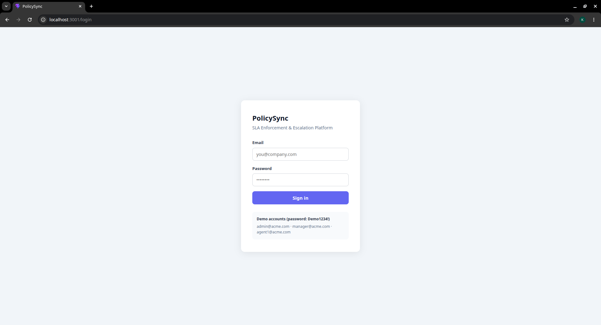
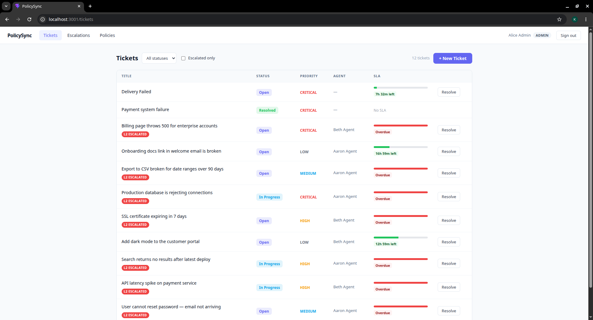
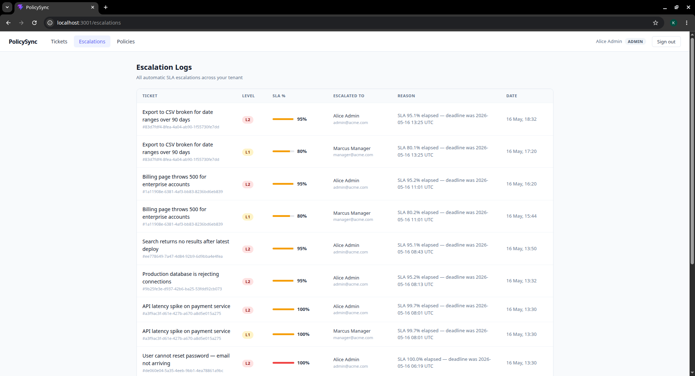
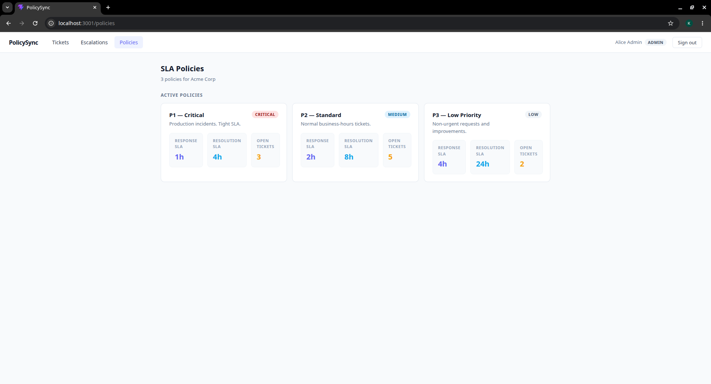
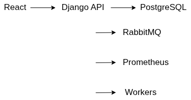

# PolicySync

[](https://github.com/Kushagra11Singh/PolicySync-Multi-Tenant_SLA-Enforcement_and_Escalation-Engine/actions/workflows/ci.yml)

**PolicySync** is a full-stack **multi-tenant SLA enforcement and automated ticket escalation platform** built to simulate real-world enterprise support infrastructure.

Organizations can define their own SLA policies for support tickets, track deadlines, and automatically escalate tickets when SLAs are close to breach or already breached.

Each tenant is fully isolated — one company cannot access another company’s data.

---
# Tech Stack

## Backend
- Django
- Django REST Framework
- PostgreSQL
- Celery
- RabbitMQ
- Redis
- drf-spectacular
- pytest

## Frontend
- React
- TypeScript
- Vite
- Axios

## DevOps / Infra
- Docker
- Docker Compose
- GitHub Actions
- Prometheus
---

## Demo Preview

### Dashboard


### Ticket Management


### Escalation Flow


### Policies

---

# Architecture



### Flow

```text
React Frontend
      |
      v
Django Policy Engine
      |
-----------------------------------
| PostgreSQL
| RabbitMQ
| Prometheus
-----------------------------------
|
├── Escalation Worker
├── Notification Dispatcher
└── Audit Logger
```

---

# Features

- Multi-tenant architecture
- JWT authentication
- Role-based access control
- SLA policy creation
- Automated ticket escalation
- Notification workflows
- Audit logging
- Prometheus monitoring
- Dockerized microservices
- GitHub Actions CI/CD
- Integration testing


---

# System Design

## Multi-Tenant Isolation
Every major model contains a tenant foreign key.

Examples:
- Users
- Tickets
- SLA Policies
- Escalations
- Audit Logs

Querysets are filtered per tenant to ensure isolation.

---

## Async Escalation Flow

```text
Ticket Created
    ↓
SLA timer starts
    ↓
Celery Beat checks deadlines
    ↓
Escalation Worker processes breach
    ↓
Notification Dispatcher sends alerts
    ↓
Audit Logger records event
```

---

# Microservices

### 1. Policy Engine
Main backend service handling:

- users
- tenants
- tickets
- policies
- auth

---

### 2. Escalation Worker
Processes SLA breaches asynchronously.

---

### 3. Notification Dispatcher
Sends:

- email alerts
- webhook alerts

---

### 4. Audit Logger
Stores compliance logs.

---

# Local Setup

```bash
git clone https://github.com/YOUR_USERNAME/policy-sync.git
cd policy-sync
cp .env.example .env
docker compose up
```

Frontend:

```bash
cd frontend
npm install
npm run dev
```

---

# API Documentation

Swagger docs:

```bash
http://localhost:8001/api/docs/
```

---

# Prometheus Metrics

```bash
http://localhost:8001/metrics
```

---

# Demo Credentials

```text
admin@acme.com
DEMO1234!
```

---

# Running Tests

```bash
docker compose exec policy_engine pytest
```

---

# GitHub CI

This project uses GitHub Actions for:

- pytest
- flake8
- docker build verification

Workflow file:

```text
.github/workflows/ci.yml
```

---

# Known Issues

- Agent assignment during ticket creation UI is not implemented yet
- Superusers without tenant association cannot create tickets

---

# Future Improvements

- Kubernetes deployment
- WebSocket live ticket updates
- Role analytics dashboard
- Better notification templates
- Cloud deployment on AWS/GCP

---

# Why this project matters

This project simulates production-style backend architecture used by platforms like:

- ServiceNow
- Jira Service Management
- Zendesk

It demonstrates:

- distributed systems thinking
- async architecture
- system design
- observability
- backend scalability patterns
